# LatihanVCS

 **Penjelasan cara penggunaan Git dan langkah-langkahnya**

1. Pastikan anda sudah mendownload aplikasi Gitnya (git-scm.com)
2. Masuk ke web GitHub. Agar Git kita terhubung dengan GitHub kita harus membuat akun terlebih dahulu
-masuk ke web GitHub
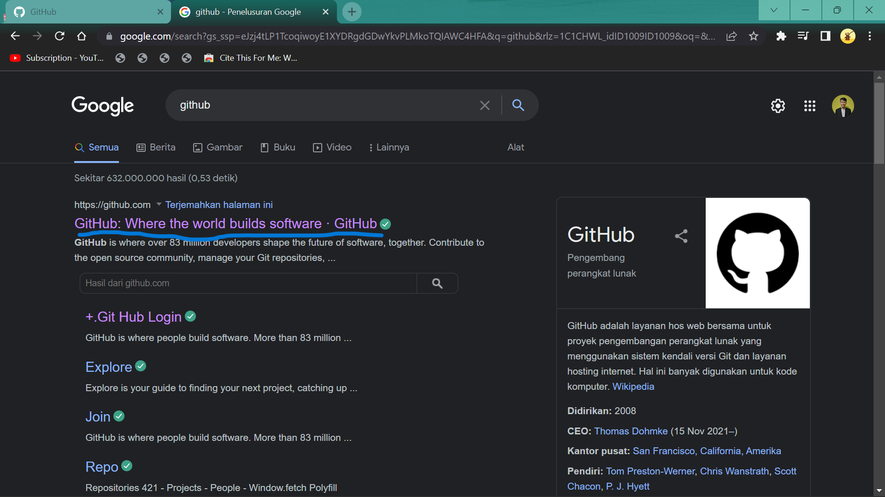

-buat akun klik "create an account"
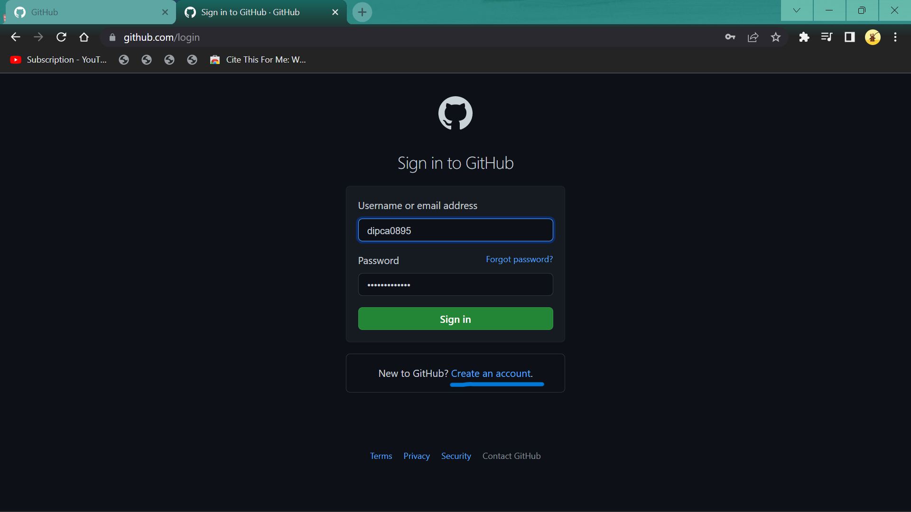

-jika sudah masuk, buatlah sebuah repository dengan cara klik new,
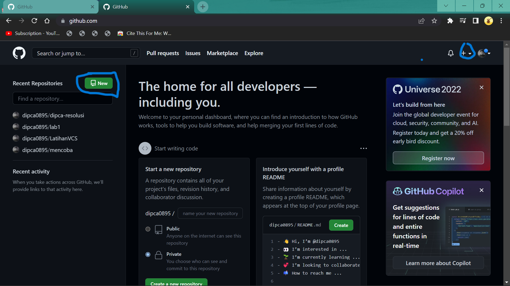
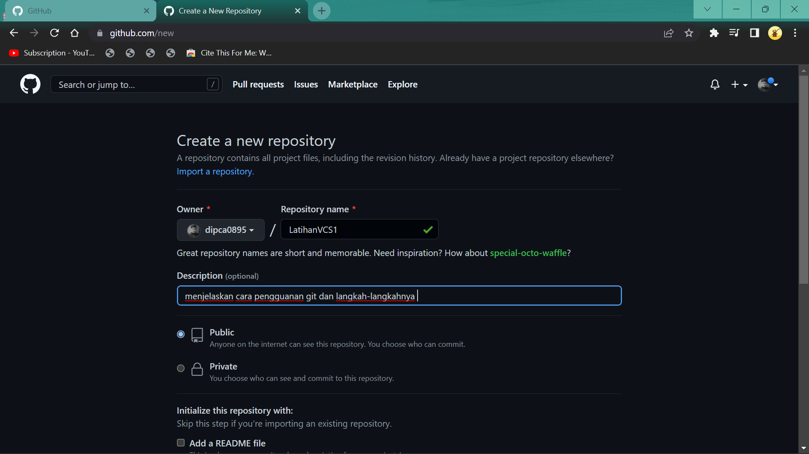
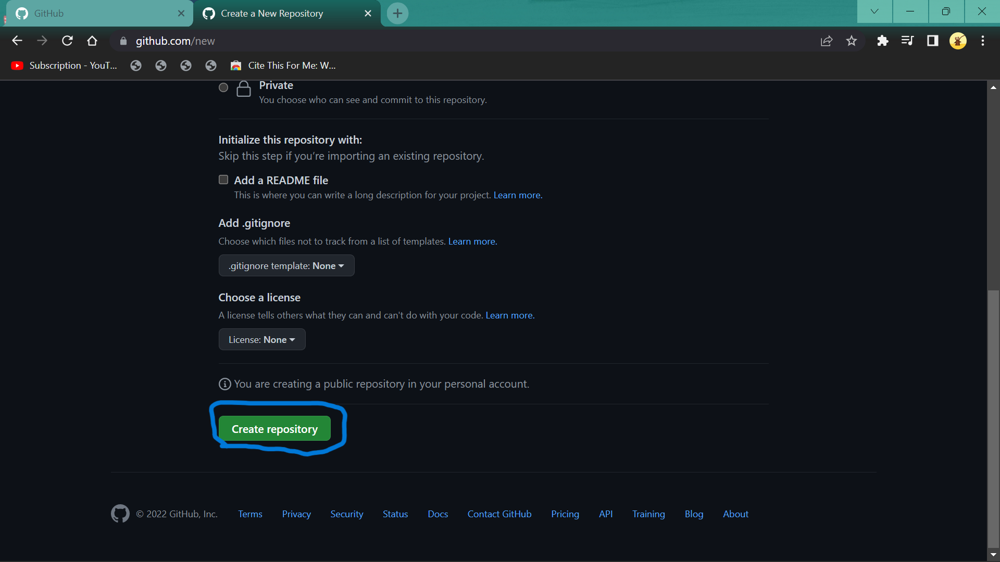

kode untuk membuat/menambah sebuah file README.md
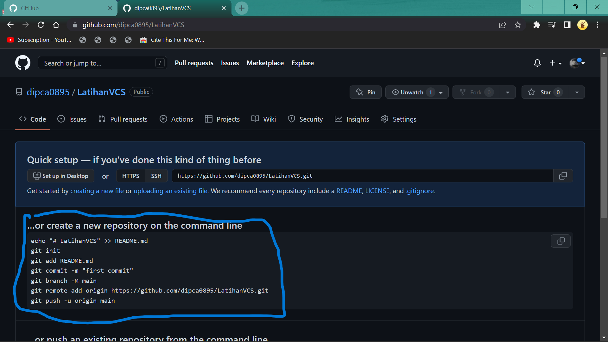
3. Buat file repository di windows explore dengan nama file "LatihanVCS"
[img.7](screenshot/p7.png)

-lalu buka menggunakan Git Bash
[img.8](screenshot/p8.png)

-menambahkan global config repository, gunakan command 
git config --global user.name "nama akun GitHub anda"
git config --global user.email "email akun GitHub anda"
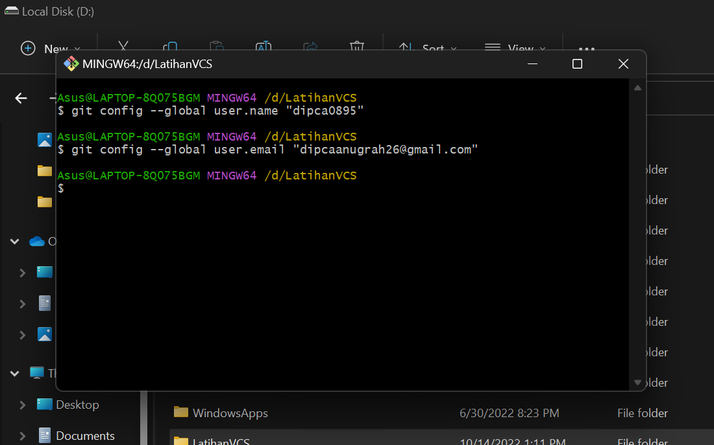

4. Pada file LatihanVCS tadi kita akan buat file tersebut menjadi repository dengan cara :
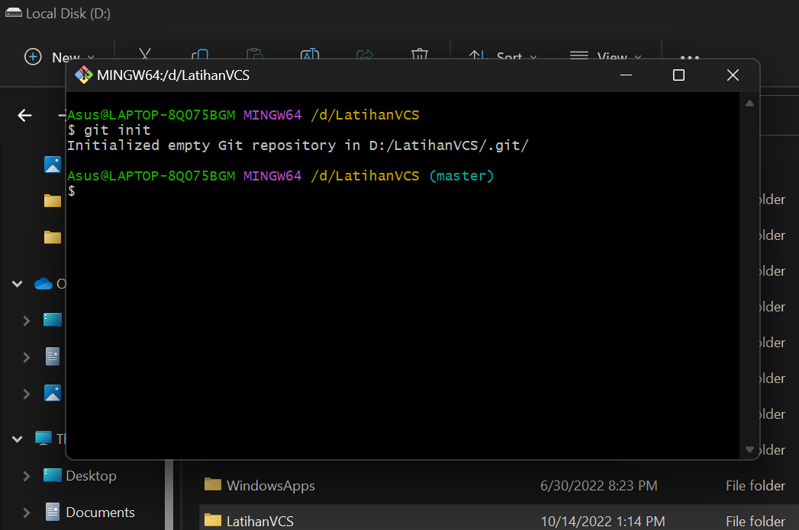

5. Lalu kita buat sebuah file README.md di dalam file repository yang kita buat tadi "LatihanVCS"
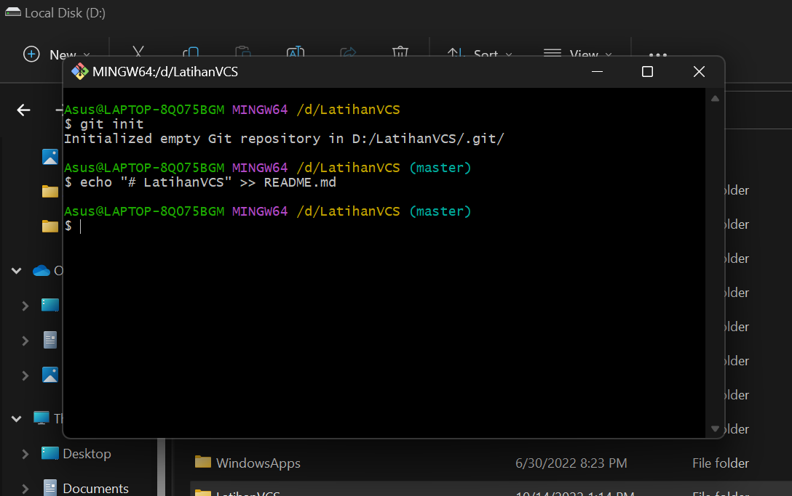

-lalu kita cek file README.md yang kita buat tadi apakah sudah di commit dan cara mengcommitnya adalah sebagai berikut:
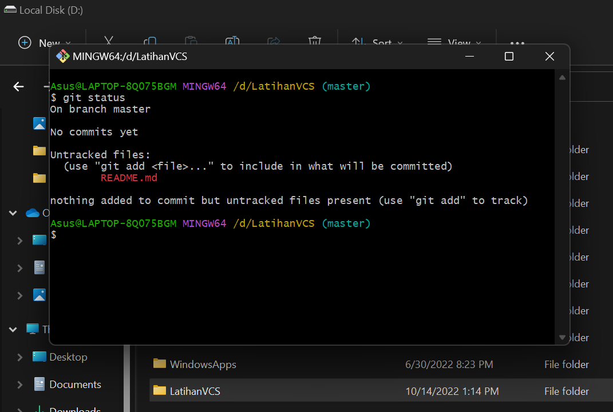
-cara add
git add "nama file"
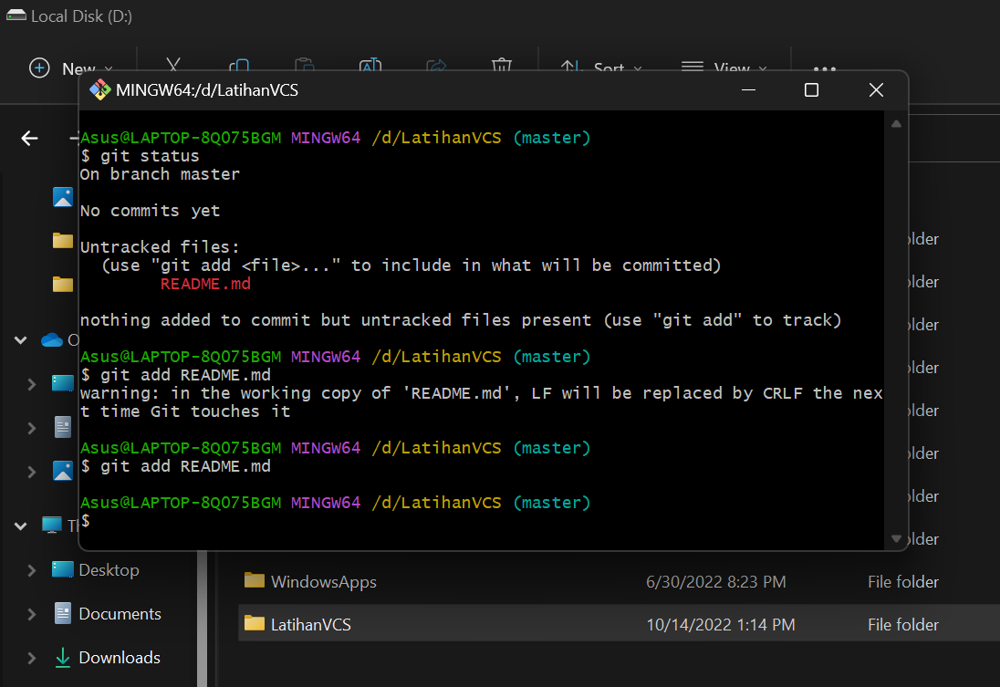
-cara commit
git commit -m "keterangannya"
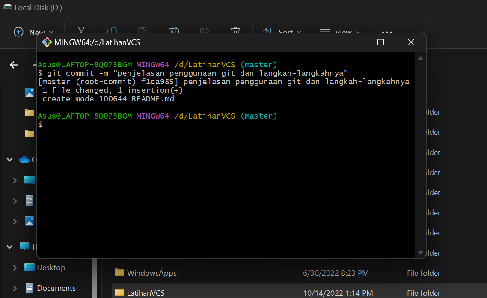